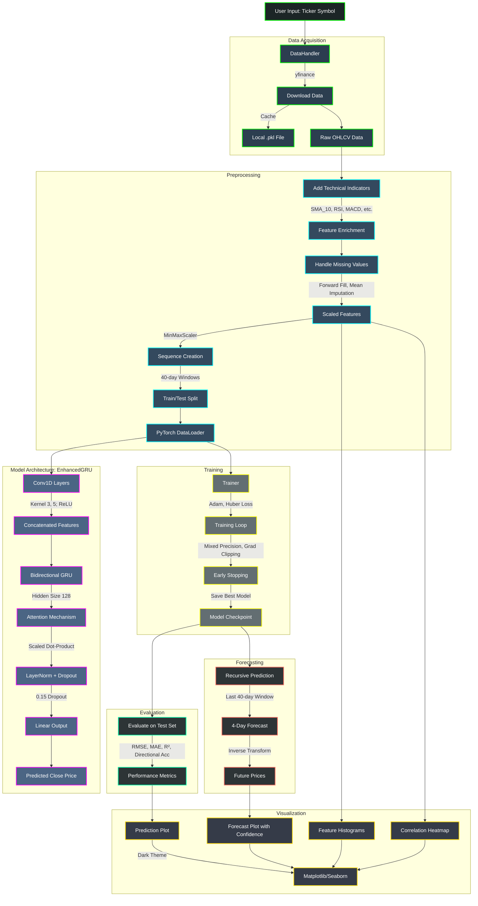

# Vision-Vest
 

<table>
  <tr>
    <td></td>
    <td></td>
  </tr>

</table>

The enhanced stock predictor is a sophisticated deep learning system designed for forecasting stock prices. It leverages a hybrid model combining Conv1D layers, bidirectional Gated Recurrent Units (BiGRU), and a scaled dot-product attention mechanism. This document provides a comprehensive, paragraph-based explanation of the workflow, emphasizing feature engineering, technical indicators, data processing, and the EnhancedGRU model’s architecture and functionality. The goal is to give a clear understanding of the system’s components, their roles, and how they contribute to robust stock price predictions, without relying on mathematical equations.

---

## Workflow Overview

The workflow starts with the user entering a stock ticker symbol, such as AAPL or TSLA, with AAPL as the default if no input is provided. Historical stock data is retrieved from Yahoo Finance using the `yfinance` library, spanning from January 1, 2022, to the current date, August 27, 2025. To optimize performance, the data is cached locally in a pickle file, allowing quick access for subsequent runs without re-downloading. 

The raw data undergoes extensive preprocessing, including the addition of various technical indicators to capture market patterns, handling missing or invalid values, and normalizing the data to a consistent scale. The processed data is then organized into 40-day sequences, split into 80% for training and 20% for testing, and loaded into PyTorch DataLoaders for efficient batch processing. The EnhancedGRU model is trained using the Adam optimizer, Huber loss for robust error handling, mixed precision for faster GPU computation, gradient clipping to stabilize training, and early stopping to prevent overfitting. After training, the model evaluates performance on the test set using metrics such as root mean squared error (RMSE), mean absolute error (MAE), R-squared (R²), and directional accuracy. It also generates recursive forecasts for the next four days by default, feeding predicted values back into the model. Results are visualized through plots showing historical prices, predictions, and forecast confidence intervals, along with feature distribution histograms and correlation heatmaps for deeper insights.

# Diagram Workflow

